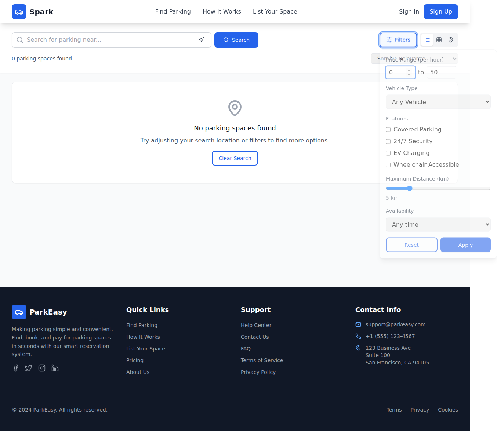
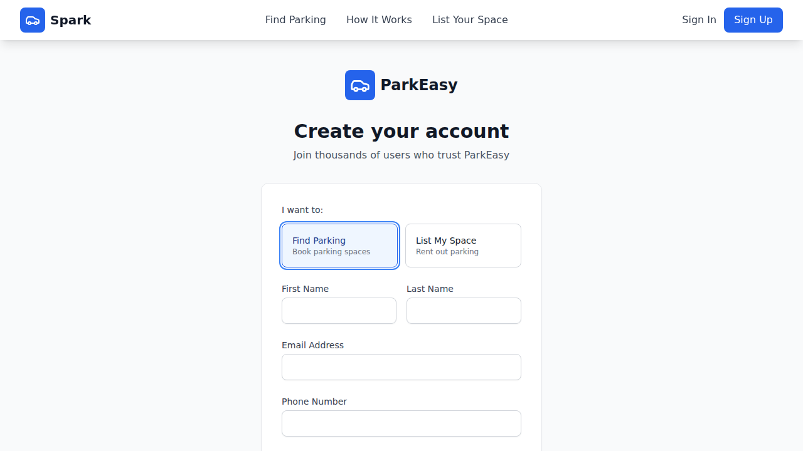
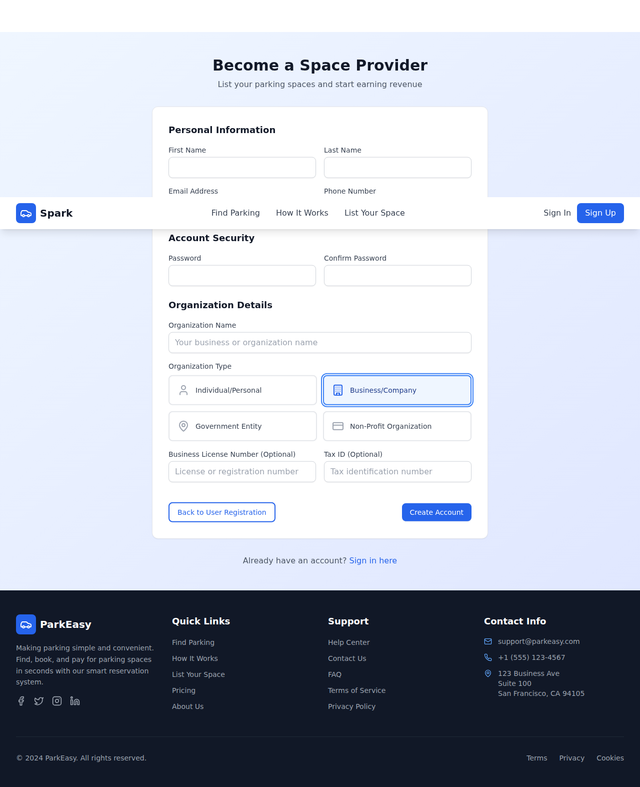
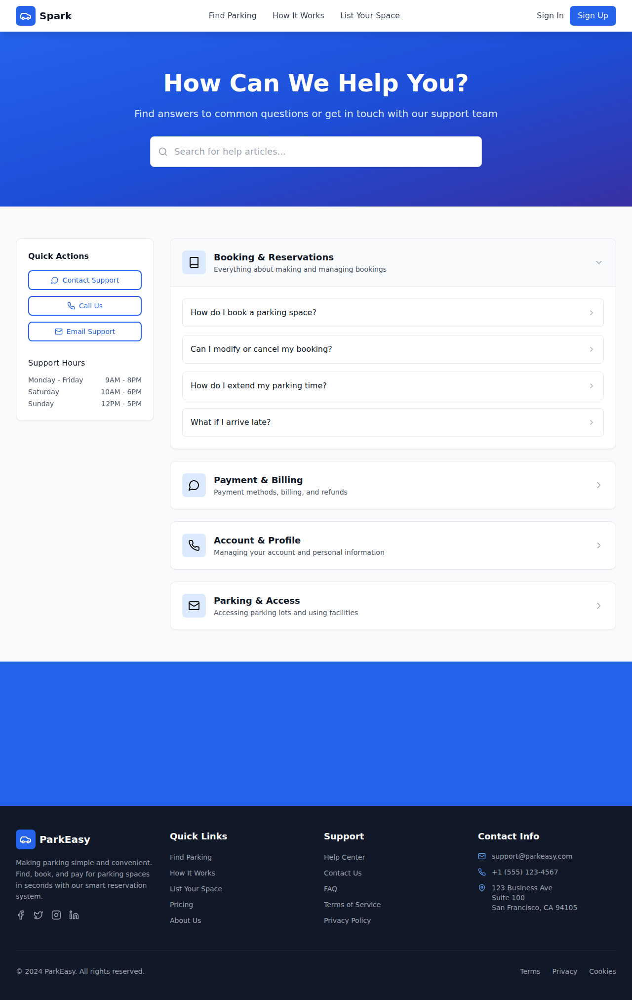
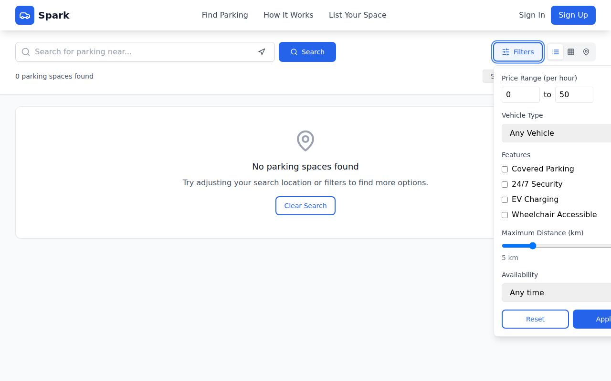

# 🚗 Spark2 - Real-Time Parking Platform

A modern React + TypeScript parking booking platform that connects Space Providers with Customers through real-time data and interactive maps.

## 🌟 Overview

Spark2 is a dual-user parking platform where Space Providers can list their parking spaces and Customers can search, filter, and book parking in real-time. Built with a database-first architecture using Supabase for real-time updates and seamless user experiences.

## 🎯 Key Features

### For Space Providers
- **Smart Dashboard**: Manage parking lot listings with real-time booking insights
- **Revenue Tracking**: Monitor earnings and booking analytics
- **Business Verification**: Secure verification process with business license validation
- **Real-time Notifications**: Instant alerts for new bookings

### For Customers
- **Advanced Search**: Find parking with enhanced location-based queries
- **Interactive Maps**: React Leaflet integration with dynamic markers and availability indicators
- **Smart Filtering**: Filter by price, vehicle type, features (covered, security, EV charging, accessibility), and distance
- **Multiple View Modes**: Switch between list, grid, and map views seamlessly

## 🏗️ Architecture

### Tech Stack
- **Frontend**: React 18 + TypeScript + Vite
- **Styling**: Tailwind CSS + Framer Motion
- **Database**: Supabase (PostgreSQL with real-time subscriptions)
- **Maps**: React Leaflet + OpenStreetMap
- **Forms**: React Hook Form + Zod validation
- **State**: Context API + React Query patterns

### Database-First Design
```typescript
// No mock data - everything connects to Supabase
const searchParkingLots = async (filters: SearchFilters) => {
    const { data, error } = await supabase
        .from('parking_lots')
        .select('*, users(*)')
        .eq('isActive', true)
        .gte('availableSpaces', 1);
    
    return { data, error };
};
```

## 🚀 Getting Started

### Prerequisites
- Node.js 18+
- Valid Supabase project credentials

### Installation
```bash
# Clone the repository
git clone <repository-url>
cd spark2

# Install dependencies
npm install

# Setup environment variables
cp .env.example .env
# Add your Supabase URL and API key

# Start development server
npm run dev
```

### Environment Setup
```env
VITE_SUPABASE_URL=your_supabase_url
VITE_SUPABASE_ANON_KEY=your_supabase_anon_key
```

## 👥 User Types & Routing

### Space Providers (`role: 'space_provider'`)
- **Registration**: `/register/space-provider`
- **Dashboard**: `/provider/dashboard`
- **Features**: Create/manage parking lots, view bookings, track revenue

### Customers (`role: 'customer'`)
- **Registration**: `/register`
- **Dashboard**: `/dashboard`
- **Features**: Search parking, make bookings, manage reservations

## 🗺️ Advanced Mapping System

### Location Search
- **Enhanced Queries**: Automatically appends "parking mall shopping center" for better results
- **Debounced Search**: 300ms delay for optimal performance
- **Geolocation Support**: Current location detection with permission handling

### Dynamic Markers
- **Vehicle Type Icons**: Different markers for car/bike/both parking
- **Availability Colors**: Visual indicators for high/medium/low availability
- **Real-time Updates**: Markers update as spaces are booked/freed

## 🔧 Component Architecture

### UI Components (`src/components/UI/`)
- **Motion-First**: Framer Motion animations with consistent timing
- **Variant System**: Multiple visual variants with Tailwind CSS
- **Error Handling**: User-friendly error messages with react-hot-toast


*Advanced Filters Focus States and Semantic Labels*

### Form Patterns
```typescript
// Standard form validation pattern
const formSchema = z.object({
    name: z.string().min(1, "Name is required"),
    location: z.object({
        lat: z.number(),
        lng: z.number()
    })
});

const form = useForm<FormData>({
    resolver: zodResolver(formSchema)
});
```

## 🔍 Filtering System

### Advanced Filters Component
- **Consolidated System**: Single `AdvancedFilters` component for all filtering needs
- **Real-time Updates**: Immediate search result and map marker updates
- **Filter Persistence**: Maintained across view mode switches
- **Filter Types**: Price range, vehicle type, features, distance, availability

## 📱 Development Workflow

### Scripts
```bash
npm run dev          # Start development server
npm run build        # Build for production
npm run preview      # Preview production build
npm run lint         # Run ESLint
```

### Database Migrations
```bash
# Run Supabase migrations
supabase db reset
supabase db push
```

## 🎨 Design System

### Animation Standards
- **Framer Motion**: Consistent timing with staggered animations (0.1s delays)
- **Interactive States**: Hover, focus, and loading states for all components
- **Performance**: Optimized animations with `layout` animations where appropriate

### Responsive Design
- **Mobile-First**: Responsive design with Tailwind breakpoints
- **Touch Optimized**: Mobile-friendly interactions and touch targets
- **Progressive Enhancement**: Graceful degradation for older devices

## 🔐 Security & Access Control

### Role-Based Access
```typescript
// Component access control
const ProviderRoute = ({ children }: { children: React.ReactNode }) => {
    const { user } = useAuth();
    
    if (user?.role !== 'space_provider') {
        return <Navigate to="/login" />;
    }
    
    return <>{children}</>;
};
```

### Data Security
- **Row Level Security**: Supabase RLS policies for data protection
- **Provider Verification**: Business license verification before space activation
- **User Privacy**: Secure handling of personal and business information

## 📊 Real-Time Features

### Live Updates
- **Space Availability**: Real-time updates when bookings are made/cancelled
- **Provider Notifications**: Instant booking alerts
- **Live Search**: Real-time filtering across provider-submitted spaces
- **Map Synchronization**: Dynamic marker updates based on current data

## 🤝 Contributing

1. Fork the repository
2. Create a feature branch (`git checkout -b feature/amazing-feature`)
3. Commit your changes (`git commit -m 'Add amazing feature'`)
4. Push to the branch (`git push origin feature/amazing-feature`)
5. Open a Pull Request

## 📝 License

This project is licensed under the MIT License - see the [LICENSE](LICENSE) file for details.

## 🙏 Acknowledgments

- **Supabase** for real-time database infrastructure
- **OpenStreetMap** for location services
- **React Leaflet** for mapping capabilities
- **Tailwind CSS** for styling system

---

**Note**: This application requires valid Supabase credentials and will not function with mock data. Ensure your environment is properly configured before development.

## 📸 Screenshots & Demo Videos

### Accessibility Enhancements


*Register Page Custom Radio Focus States*


*Header User Menu Accessibility Focus States*


*Space Provider Custom Radio Focus States*


*Help Center Accordion Focus States*


*Header User Menu Focus States*


*Contact Owner Button Focus States*


*Added aria-hidden to decorative phone icon in Contact Owner Button*


## Screenshots & Demo Videos
- `public/space-provider-password-toggle.png` - Visual verification of the password visibility toggle in the Space Provider Registration page.
### Accessibility Enhancements
- Replaced generic `div` wrappers with semantic `fieldset` and `legend` elements for grouped inputs (Price Range and Features) in the `AdvancedFilters` component to ensure screen readers correctly associate the group title with its interactive elements.


